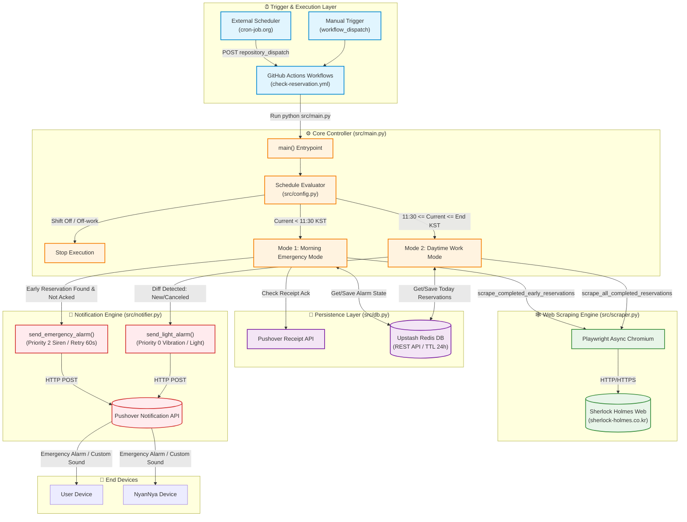
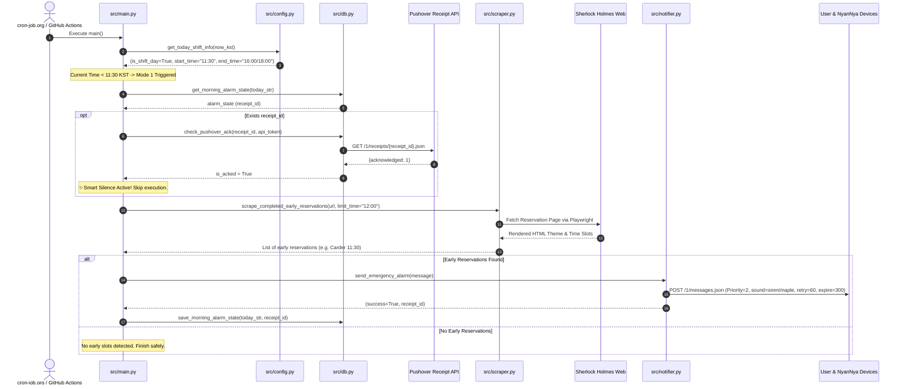
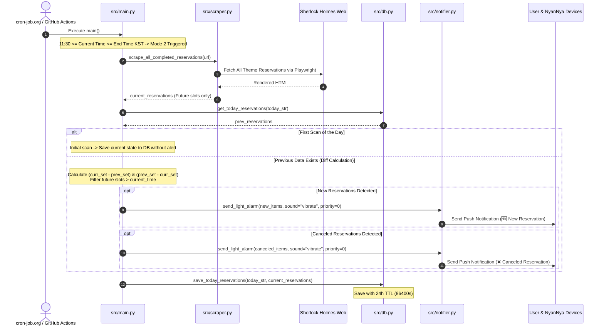
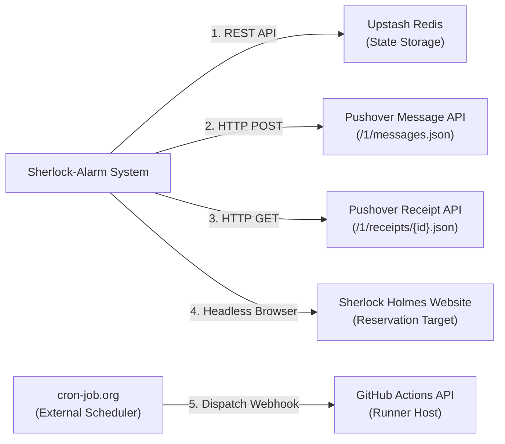

# 🏗️ Sherlock-Alarm Backend Architecture

본 문서는 **Sherlock-Alarm (nyannya_molert)** 프로젝트의 백엔드 시스템 아키텍처, 데이터 흐름, 핵심 컴포넌트 구조 및 머메이드(Mermaid) 시각화 다이어그램을 설명합니다.

---

## 1. 시스템 전체 아키텍처 (Overall Architecture Diagram)



---

## 2. 모드별 시퀀스 다이어그램 (Sequence Diagrams)

### 2.1 Mode 1: 아침 긴급 알람 모드 (Morning Emergency Mode, `< 11:30 KST`)

아침 출근 전 지정된 시각(12:00) 이전의 조기 예약 완료 건을 감지하여 스마트폰 무음/방해금지 모드를 우회하는 비상 알람을 발송합니다. **Smart Silence** 메커니즘을 통해 사용자가 이미 알람을 확인(Ack)한 경우 2차 알람을 자동 차단합니다.



---

### 2.2 Mode 2: 근무 시간대 실시간 예약 변동 모드 (Daytime Work Mode, `11:30 ~ 18:00 KST`)

근무 시간 동안 10분 간격으로 전체 예약 상태를 스캔하여 직전 상태와 비교(Diffing)한 후, 신규 예약 또는 예약 취소 발생 시 가벼운 알림(Priority 0, 진동/음성)을 발송합니다.



---

## 3. 핵심 컴포넌트 명세 (Core Components)

| 컴포넌트 | 경로 | 주요 역할 및 기능 |
|---|---|---|
| **Workflow Pipeline** | [.github/workflows/check-reservation.yml](file:///c:/Users/lmh16/playground/nyannya_molert/.github/workflows/check-reservation.yml) | GitHub Actions 서버리스 파이프라인. `repository_dispatch` 및 `workflow_dispatch` 이벤트 수신, Python/Playwright 환경 빌드 및 Secrets 주입 후 스크립트 실행 |
| **Shift Config Evaluator** | [src/config.py](file:///c:/Users/lmh16/playground/nyannya_molert/src/config.py) | KST(UTC+9) 타임존 변환, 요일별 근무 스케줄 설정 파싱(`SHIFT_SCHEDULE_JSON` / 기본 월~수), 당일 근무 여부, 출퇴근 시간 및 시스템 시간/알람 상수(Single Source of Truth: `MONITOR_START_TIME`, `EARLY_THRESHOLD_LIMIT`, `PUSHOVER_RETRY`/`EXPIRE`) 중앙 반환 |

| **Main Orchestrator** | [src/main.py](file:///c:/Users/lmh16/playground/nyannya_molert/src/main.py) | 백엔드 진입점. 현재 시각 기반 실행 모드 분기(오프 / 오전 긴급 모드 / 근무 실시간 변동 모드) 및 모듈 간 비즈니스 오케스트레이션 |
| **Web Scraper Engine** | [src/scraper.py](file:///c:/Users/lmh16/playground/nyannya_molert/src/scraper.py) | Playwright Async Chromium 기반 셜록홈즈 아산점 웹 크롤러. 지수 백오프 재시도(Max 3회), 과거 슬롯 자동 오탐 방지 및 탐색 조기 종료 최적화 포함 |
| **State & Persistence Manager** | [src/db.py](file:///c:/Users/lmh16/playground/nyannya_molert/src/db.py) | Upstash Redis REST API 클라이언트. 24시간 TTL 연동, 당일 예약 목록 저장/조회, 아침 비상 알람 영수증(Receipt) 상태 및 Pushover Ack 확인 API 호출 |
| **Notification Dispatcher** | [src/notifier.py](file:///c:/Users/lmh16/playground/nyannya_molert/src/notifier.py) | Pushover HTTP REST API 클라이언트. 다중 사용자(`PUSHOVER_USER_KEY`) 개별 지원, 유저별 맞춤 사운드 매핑, Priority 2(긴급 무음 우회) / Priority 0(가벼운 진동) 전송 |

---

## 4. 데이터베이스 및 렌더링 상태 구조 (Data & State Schema)

Upstash Redis(REST API)에 저장되는 데이터 키 구조와 TTL 규격은 다음과 같습니다.

### 4.1 예약 변동 감지용 키 (`reservations:{YYYY-MM-DD}`)
* **Format**: JSON Array
* **TTL**: 86,400초 (24시간)
* **Example**:
```json
[
  {"theme": "Carder", "time": "11:30"},
  {"theme": "귀로여관", "time": "14:20"}
]
```

### 4.2 아침 긴급 알람 상태 키 (`morning_alarm:{YYYY-MM-DD}`)
* **Format**: JSON Object
* **TTL**: 86,400초 (24시간)
* **Example**:
```json
{
  "receipt": "r5x9q2m...",
  "sent_at": "09:40",
  "count": 1
}
```

---

## 5. 외부 서비스 연동 (External Dependencies)


